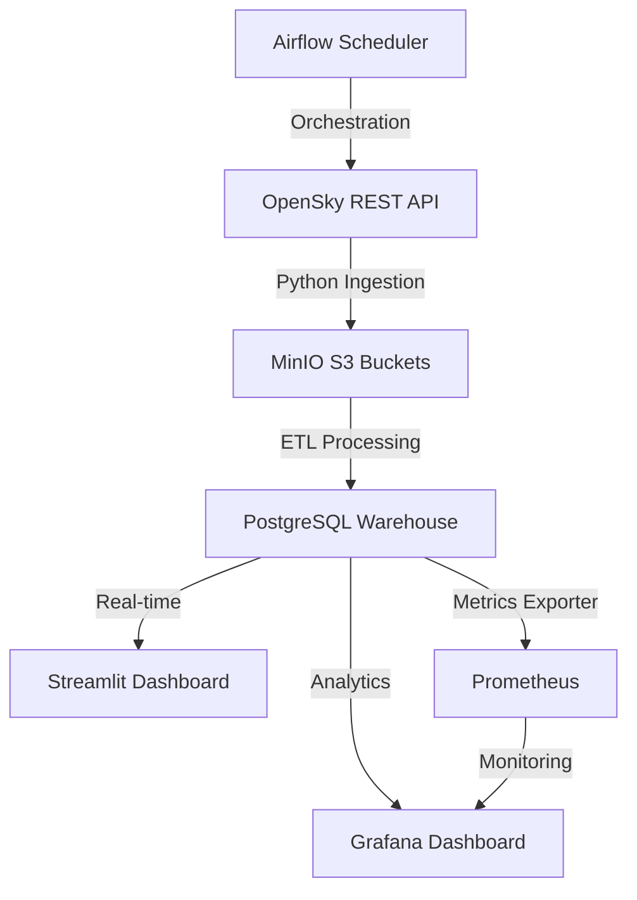

# ✈ Aircraft Tracking & BigData Analytics Dashboard

Ce projet est une solution complète de **Data Engineering** et de **Visualisation** permettant de suivre les avions du monde entier en temps réel via l'API OpenSky Network. La solution inclut une architecture moderne et scalable basée sur Docker.

---

## 🏗 Architecture du Projet

Le flux de données suit une architecture moderne de type Data Lakehouse :



---

## 🚀 Services & Accès

Une fois lancé, les services suivants sont disponibles sur votre machine locale :

| Service | Interface | Accès Local | Identifiants par défaut |
| :--- | :--- | :--- | :--- |
| **Streamlit** | Dashboard Interactif | [localhost:8501](http://localhost:8501) | — |
| **Airflow** | Orchestration ETL | [localhost:8081](http://localhost:8081) | `admin` / `admin` |
| **Grafana** | Monitoring & Analytics | [localhost:3050](http://localhost:3050) | `admin` / `admin` |
| **MinIO** | Object Storage Console | [localhost:9001](http://localhost:9001) | `minioadmin` / `minioadmin` |
| **Prometheus** | Métriques brutes | [localhost:9090](http://localhost:9090) | — |

---

## 🛠 Installation Rapide

1. **Prérequis** :
   - [Docker Desktop](https://www.docker.com/products/docker-desktop/) installé sur Windows.
   - Une clé API [Geoapify](https://myprojects.geoapify.com/) (gratuite) pour la géolocalisation inversée.

2. **Configuration** :
    - Copiez le fichier d'exemple : `cp .env.example .env`.
    - Remplissez votre clé `GEOAPIFY_API_KEY`.
    - **Générez une clé Fernet** pour Airflow (obligatoire) :
      ```powershell
      python -c "from cryptography.fernet import Fernet; print(Fernet.generate_key().decode())"
      ```
      Copiez cette clé dans la variable `AIRFLOW__CORE__FERNET_KEY` de votre fichier `.env`.

3. **Lancement** :
   ```powershell
   docker compose up -d --build
   ```

---

## 💡 Utilisation d'Airflow

Le projet utilise **Airflow** pour automatiser la récupération des données toutes les quelques minutes. 
- Allez sur [http://localhost:8081](http://localhost:8081).
- Activez le DAG nommé `flight_etl_pipeline`.
- Le pipeline va automatiquement :
    1. Télécharger les données depuis OpenSky.
    2. Les stocker brute dans MinIO.
    3. Les transformer (reverse geocoding) et les injecter dans PostgreSQL.

---

## 🛠 Dépannage (Troubleshooting)

### Écran de chargement infini sur Streamlit ?
Si le dashboard Streamlit reste bloqué sur l'écran gris de chargement :
- **Désactivez votre VPN** : Les navigateurs et les VPN bloquent parfois les Websockets locaux nécessaires à Streamlit.
- **Vérifiez votre AdBlock** : Désactivez-le pour `localhost`.
- **Navigateur** : Si vous utilisez Firefox ou Edge, essayez une fenêtre de navigation privée ou Chrome.

---

## 📂 Structure du Code
- `dags/` : Définition des workflows Airflow.
- `src/` : Scripts de migration, ingestion et traitement.
- `dashboard.py` : Code source de l'interface Streamlit.
- `metrics_exporter.py` : Calcul des KPIs pour le monitoring Prometheus/Grafana.
- `docker-compose.yml` : Orchestration de l'infrastructure complète.
